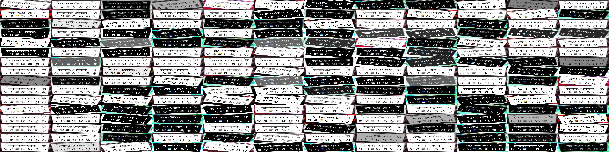

<h2 align="center">🤖🚗 Bangla synthetic license plates 🚗🤖</h2>

## ❓❓ ❔❔

A Bangla license plates dataset (synthetic), generated with a mixture of deep learning (GAN) and image processing.  The labels are in darknet yolo format. **[.txt, .data, .names]**

**N.B: The dataset does not contain any real license plates nor does it emulate any real license plates directly. Instead the license plates are generated from uniform distribution of valid license plate characters for bangla.**

## 🔎🔎

https://www.kaggle.com/furcifer/bangla-license-plates-synthetic

## 📝📝

[x] Dataset 
[ ] Publish the synthetic data generator